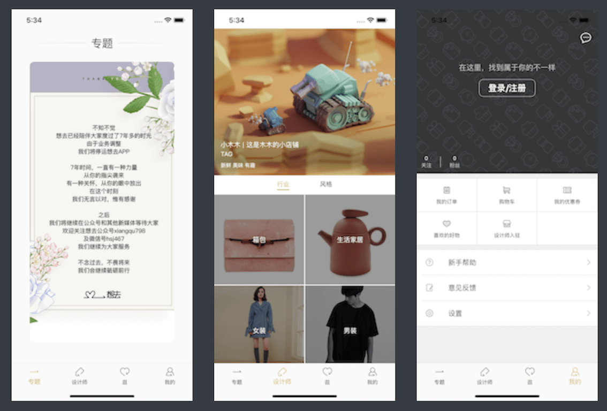

## xiangqu

### 简介
用flutter实现一个app的简单仿写，侧重于flutter知识点的运用，只是简单的仿写若干页面，用于练习flutter基本开发。

### 页面



### 使用fluro管理路由

+ https://pub.flutter-io.cn/packages/fluro

+ 定义路由处理

  ```dart
  //route_handlers.dart
  import 'package:flutter/material.dart';
  import 'package:fluro/fluro.dart';
  import '../pages/web_page.dart';
  //webview路由的跳转处理
  var webviewHandler = Handler(
    handlerFunc: (BuildContext context, Map<String, List<String>> params){
      String url = params["url"]?.first;
      return WebPage(url: url);
    }
  );
  ```

  ```dart
  //routers.dart
  import 'package:fluro/fluro.dart';
  import 'package:flutter/material.dart';
  import './route_handlers.dart';
  
  class Routes {
  
    static Router _router; 
    //路由名
    static String webview = "/webview"; 
  
    static void configureRoutes(Router router) {
      _router = router;
      router.notFoundHandler = Handler(
        handlerFunc: (BuildContext context, Map<String, List<String>> params) {
        print("ROUTE WAS NOT FOUND !!! $params");
        return Text("");
      });
      //配置webview
      router.define(webview, handler: webviewHandler);
    }
  
    //处理参数为中文的情况
    static navigateTo(BuildContext context, String path, Map<String, dynamic> params, {TransitionType transition}) {
      String query =  "";
      int index = 0;
      for (var key in params.keys) {
        var value = Uri.encodeComponent(params[key]);
        if (index == 0) {
          query = "?";
        } else {
          query = query + "\$";
        }
        query += "$key=$value";
        index++;
      }
      path = path + query;
      _router.navigateTo(context, path, transition:transition);
    }
  
    static pop(BuildContext context) {
      _router.pop(context);
    }
  }
  ```

+ 在main.dart中全局配置路由

  ```dart
  void main() {
    ....
    ....
    final router = Router();
    Routes.configureRoutes(router);
  }
  
  ```

  

+ 使用路由

  ```dart
  //跳转webview页面
  Routes.navigateTo(context, Routes.webview, {"url":url}, transition:TransitionType.native );
  ```

### 缓存图片

+ cache_network_image: https://pub.flutter-io.cn/packages/cached_network_image

+ 使用

  ```dart
  Widget _itemBuilder(context, index) {
      return Container(
        child: ClipRRect(
          borderRadius: BorderRadius.circular(10),
          child: CachedNetworkImage(
            imageUrl: Provide.value<HomeProvide>(context).list[index].image ,
            fit: BoxFit.cover,
            placeholder: (context, url) {
               return Center(
                 child: Image.asset("assets/images/topic_default_image.png", fit: BoxFit.cover,),
               );
            },
          ),
        ),
        decoration: BoxDecoration(borderRadius: BorderRadius.circular(10)),
      );
    }
  ```

### 不同尺寸适配

+ flutter_screenutil: https://pub.flutter-io.cn/packages/flutter_screenutil

+ 示例

  ```dart
  //在布局开始前，初始化screenUtil
  ScreenUtil.instance = ScreenUtil(width: 375, height: 667)..init(context);
  
  //当设置宽高时，如下所示
  Container(
     width: ScreenUtil().setWidth(43),
     height: ScreenUtil().setHeight(43),
     ....
     ....
   )       
  ```

### 网络请求

+ dio: https://pub.flutter-io.cn/packages/dio

+ 简单实现

  ```dart
  class URL {
    static const baseUrl = "http://api.xiangqu.com/";
    static const topic = "ios/topic";
    static const recommend_designer = "designer2/recommend/operate";
    static const designer_category = "designer2/tag/index";
    static getUrl(String path) {
      return baseUrl + path;
    }
  }
  class Network {
    static _commondio() {
      var dio = new Dio();
      dio.options.contentType =
          ContentType.parse("application/x-www-form-urlencoded");
      return dio;
    }
    static _request(String method, String path, {Map data}) async {
      var dio = Network._commondio();
      var result = Map<String, dynamic>();
  
      try {
        var responseData;
        if (method == "get") {
          var response = await dio.get(URL.getUrl(path));
          responseData = response.data;
        } else if (method == "post") {
          var response = await dio.post(URL.getUrl(path), data: data);
          responseData = response.data;
        }
        // print("responseData" + responseData.toString());
        if ((responseData is Map) &&
          responseData["code"] == 200 &&
          responseData["data"] != null) {
          result["data"] = responseData["data"];
          result["error"] = null;
          result["code"] = responseData["code"];
        } else {
          result["data"] = null;
          result["error"] = responseData["msg"];
          result["code"] = responseData["code"];
          if (result["error"] != null) {
            Fluttertoast.showToast(
                msg: result["error"],
                toastLength: Toast.LENGTH_SHORT,
                gravity: ToastGravity.CENTER,
                timeInSecForIos: 1,
                backgroundColor: Colors.black,
                textColor: Colors.white,
                fontSize: 16.0);
          }
        }
      } catch (err) {
        result["data"] = null;
        result["error"] = err.message;
        result["code"] = err.response != null ? (err.response as Response).statusCode:-1000;
      }
      // print("result $result");
      return result;
    }
    /*
     *  专题
     */
    static Future<Map<String, dynamic>> topics() async {
      var formData = {
        "key": "867a43ce96837773ecdbecfdb96aa3ed",
        "t": DateTime.now().millisecondsSinceEpoch
      };
      return await _request('post', URL.topic, data: formData);
    }
    /*
     *  推荐设计师
     */
    static Future<Map<String, dynamic>> recommendDesigner() async {
    
      return await _request('post', URL.recommend_designer,data: {});
    }
  
     /*
     *  设计的种类
     */
    static Future<Map<String, dynamic>> designerCategory() async {
    
      return await _request('post', URL.designer_category,data: {});
    }
  }
  
  ```

#### 配合FutureBuilder使用

```dart
class HomePage extends StatelessWidget {

  HomePage({Key key}) : super(key: key);
  
  @override
  Widget build(BuildContext context) {
    // LinearGradient(colors: [Colors.amberAccent, Colors.lightBlue, Colors.red]);
    return Scaffold(
      appBar: HomeTitle.builder(),
      body: Container(
        padding: EdgeInsets.only(
            top: ScreenUtil().setHeight(15),
            bottom: ScreenUtil().setHeight(35)),
        child: FutureBuilder(
          future: getTopics(context),
          builder: (context, snapshot) {
            if (snapshot.hasData) {
              return Provide<HomeProvide>(
                builder: (context, child, homeProvide) {
                  return HomeSwiper(
                    onTap: (index) {
                      var model = homeProvide.list[index];
                      print("image" + model.image);
                      var url = model.url;
                      //暂时用百度替代链接
                      url = "https://www.baidu.com";
                      Routes.navigateTo(context, Routes.webview, {"url":url}, transition:TransitionType.native );
                    },
                  );
                },
              );
            } else {
              return Center(
                child: Text('加载中...'),
              );
            }
          },
        ),
      ),
    );
  }
  Future getTopics(BuildContext context) async {
    //数据请求
    var result = await Network.topics();
    if (result["data"] != null) {
      var listModel = ThemeListModel.fromJson(result);
      Provide.value<HomeProvide>(context).setListModel(listModel.data);
    }
    return "";
  }
}

```

### 使用provider 管理数据

+ provider: https://pub.flutter-io.cn/packages/provider

+ 基本配置

  ```dart
  import 'package:flutter/material.dart';
  import './pages/index_page.dart';
  import './provide/index_provide.dart';
  import './provide/swiper_index_provide.dart';
  import './provide/home_provide.dart';
  import 'package:provide/provide.dart';
  import './routers/routes.dart';
  import 'package:fluro/fluro.dart';
  import 'package:xiangqu/provide/designer_provider.dart';
  void main() {
    //Providers  google 
    final providers = Providers();
    providers
      ..provide(Provider.function((context) => IndexProvide()))
      ..provide(Provider.function((context) => HomeProvide()))
      ..provide(Provider.function((context) => DesignerProvide()))
      ..provide(Provider.function((context) => SwiperIndexProvide()));
    
    runApp(ProviderNode(
      providers: providers,
      child: MyApp(),
    ));
  }
  
  class MyApp extends StatelessWidget {
    @override
    Widget build(BuildContext context) {
      return MaterialApp(
        title: '想去',
        debugShowCheckedModeBanner: false,
        theme: ThemeData(primarySwatch: Colors.blue, primaryColor: Colors.white),
        home: IndexPath(),
      );
    }
  }
  
  ```

+ 以IndexProvide为例

  ```dart
  //IndexProvide.dart
  import 'package:flutter/foundation.dart';
  //mixins
  class IndexProvide with ChangeNotifier {
    
    int currentIndex = 0;
    //改变currentIndex
    changeIndex(int index) {
      this.currentIndex = index;
      //通知所有的观察者
      notifyListeners();
    }
  }
  ```

+ 当currentIndex改变时通知观察者

  ```dart
  import 'package:flutter/material.dart';
  import 'package:provide/provide.dart';
  import 'package:xiangqu/provide/index_provide.dart';
  import 'package:flutter_screenutil/flutter_screenutil.dart';
  import './home_page.dart';
  import './designer_page.dart';
  import './shopping_page.dart';
  import './mine_page.dart';
  
  
  class IndexPath extends StatelessWidget {
    final pages = [
      HomePage(),
      DesignerPage(),
      ShoppingPage(),
      MinePage(),
    ];
    IndexPath({Key key}) : super(key: key);
  
    BottomNavigationBarItem _bottomItem(String title, int index ,int currentIndex) {
      var normalImageName = "";
      var selectedImageName = "";
      if (index == 0) {
        normalImageName = "assets/images/icn_zhuanti.png";
        selectedImageName = "assets/images/icn_zhuanti_highlight.png";
      } else if (index == 1) {
        normalImageName = "assets/images/icn_designer.png";
        selectedImageName = "assets/images/icn_designer_highlight.png";
      } else if (index == 2) {
        normalImageName = "assets/images/icn_guang.png";
        selectedImageName = "assets/images/icn_guang_highlight.png";
      } else if (index == 3) {
        normalImageName = "assets/images/icn_mycenter.png";
        selectedImageName = "assets/images/icn_mycenter_highlight.png";
      } 
      return BottomNavigationBarItem(
            icon: Container(
                    child: Image.asset(currentIndex != index ? normalImageName:selectedImageName),
                    width: 25,
                    height: 25,
                    ),
            title: Text(title),
        );
    }
    @override
    Widget build(BuildContext context) {
     //初始化screenUtil
     ScreenUtil.instance = ScreenUtil(width: 375, height: 667)..init(context);
  
      return Provide<IndexProvide>( //观察IndexProvide
        builder: (BuildContext context, Widget child, IndexProvide indexProvide) {
          return Scaffold(
            body: IndexedStack(
              children: pages,
              index: indexProvide.currentIndex, //当前的index
            ),
            bottomNavigationBar: BottomNavigationBar(
              type: BottomNavigationBarType.fixed,
              items: [
                _bottomItem("专题", 0,indexProvide.currentIndex),
                _bottomItem("设计师", 1,indexProvide.currentIndex),
                _bottomItem("逛", 2,indexProvide.currentIndex),
                _bottomItem("我的", 3,indexProvide.currentIndex),              
              ],
              selectedItemColor: Color.fromARGB(255, 212, 183, 104),
              unselectedItemColor: Colors.black,
              currentIndex: indexProvide.currentIndex,
              onTap: (index) {
                //更改currentIndex，并重新渲染Scaffold
                indexProvide.changeIndex(index);
              },
            ),
          );
        },
      );
    }
  }
  
  ```

### 其他

+ 主要采用flutter提供的row， column等flex布局组件来实现页面布局

### 参考资料

+ [Dart基本语法](http://www.cndartlang.com/dart)
+ [Flutter中文网](https://flutterchina.club/)
+ [开源库地址](https://pub.dev/packages)
+ [基础教程](https://jspang.com/posts/2019/01/20/flutter-base.html)
+ [百姓生活+ ](https://github.com/shenghy/flutter_shop)

